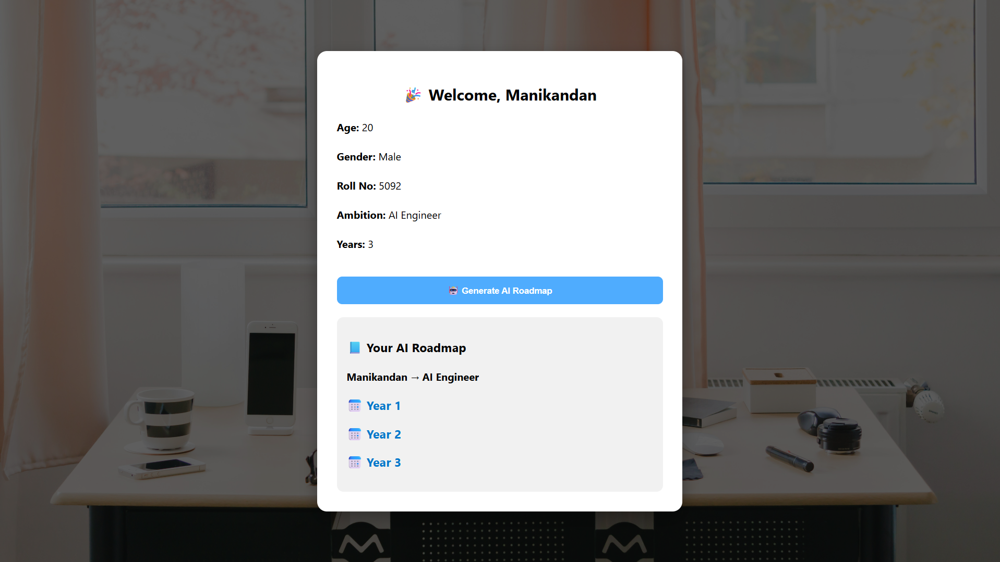

# 🚀 Future Path AI – Career Roadmap Generator

An AI-powered full-stack web application that generates **personalized career roadmaps** based on user goals.

---

## 🌟 Features

- 🤖 AI-generated roadmap using Gemini API  
- 📊 Interactive dashboard (expandable years & phases)  
- 💾 Roadmap stored in MySQL database  
- 🔐 User authentication system  
- ⚡ Full-stack architecture (React + Spring Boot)  

---

## 🛠️ Tech Stack

- Frontend: React.js  
- Backend: Spring Boot (Java)  
- Database: MySQL  
- AI: Gemini API  

---

## 📸 Application Flow

### 🔐 Step 1: Login


---

### 📝 Step 2: Enter Details & Ambition


---

### 🤖 Step 3: AI Roadmap Generation

---

### 📊 Step 4: Interactive Dashboard


---

## ⚙️ How to Run Locally

### 🔧 Backend
```bash
cd backend
mvn spring-boot:run